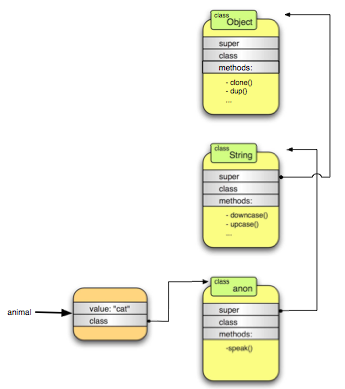

<!SLIDE ruby_object_model subsection transition=scrollUp>
# Ruby Object Model #

<!SLIDE classes smaller transition=scrollUp>
# Classes #

	@@@ ruby
    class BankAccount
	  attr_accessor :name, :account_no
	  attr_reader :balance

	  def initialize(name)
	    @name = name
	    @balance = 0
	  end

	  def deposit(amount)
	    @balance += amount
	  end

	  def withdraw(amount)
	    @balance += amount
	  end

	  def active?
	    #is account active or not
	  end
	end

	account = BankAccount.new("Samnang")

<!SLIDE inheritance transition=scrollUp>
# Inheritance #
	
	@@@ ruby
	class Animal
	  # ...
	end
	
	class Cat < Animal
	  # ....
	end
	
	class Dog < Animal
	  # ...
	end

<!SLIDE mixins small transition=scrollUp>	
# Mixins #

    @@@ ruby
    module A
	  def say_hello
	    puts "Hello"
	  end
	end

	module B
	  def say_goodbye
	    puts "Goodbye"
	  end
	end

	class C
	  include A
	  include B
	end

	obj = C.new
	obj.say_hello
	obj.say_goodbye

<!SLIDE namespace transition=scrollUp>	
# Namespaces #

    @@@ ruby
	module XML
	  class Parser
	    # ...
	  end
	end
	
	module PDF
	  class Parser
	    # ...
	  end
	end
	
	XML::Parser
	PDF::Parser

<!SLIDE singleton_method smaller transition=scrollUp>	
# Singleton Methods #

    @@@ ruby
	animal = "cat"
	another_aminal = "dog"
	
	def animal.speak
	  puts "The #{self} says miaow"
	end
	
	an_array.speak # The cat says miaow
	another_animal.speak 
	# NoMethodError: undefined method `speak' for "dog":String

<!SLIDE object_model center transition=scrollUp>
# Object model for a basic class #

<!SLIDE singleton_class center transition=scrollUp>
#Singleton class involved #

<!SLIDE what_is_single_class bullets center transition=scrollUp>
.notes demo how to access singleton class in Ruby 1.8 and Ruby 1.9

# Singleton classes #
(Eigenclasses/Metaclasses/Virtual Classes/Ghost classes)

* It's an anonymous class that you can't instantiate object from it
* It's hidden
* It is created automatically by the interpreter when you refer to it at the first time
* Except from those above, it works like normal classes
  Picture of the singleton class